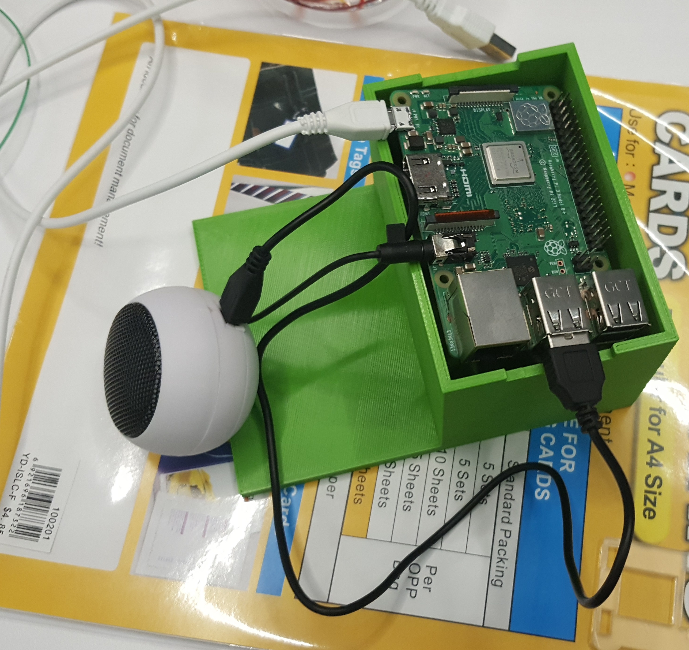

# Making an Incubation Hob talk to aid the Visually-Impaired
This project documents the work done for the inaugural Makethon held by Tikkun Olam Makers in Singapore.

## Challenge
The challenge for our team is as follows:

## Solution

We added a raspberry pi with speaker and 5 switches as an external add-on to the hob. The idea is to get the user to press two switches at any one time (one going to the raspberry pi and one for the hob) so that the raspberry pi is synchronised with the hob and will play the corresponding audio files.

Also, the Design Team provided solutions to make the hob safer for the Visually-Impaired to use. Silicone pad is added to indicate the position of the pot, and stickers are added to indicate the position of the switches.

### Materials
1. Raspberry Pi
2. Speaker
3. 5 button switches
4. Silicone pads

TOTAL COST < $80 excluding the off-the-shelf hob (~$60)

## Circuit diagram
The hardware connectivity is as follows:

*Note: There actually is no need for two resistors for each switch. One resistor to ground will suffice.

## Software logic
The raspberry pi is programmed to follow the logic of the hob as follows. 
The aim is to keep the hob simple to use and hence, some additional features were de-activated/not programmed into the raspberry pi.

## Prototype
The final prototype that was presented looks like this:

For this prototype, we also took out the display panel (4 digits 7 segment display) as it was too dim where it originally was in the hob.

## Future Improvement
The key problem of this solution is ensuring that the user presses two buttons at any one time. A feedback loop can be implemented in future to check that the raspberry pi and the hob are both at the same state. For example, the raspberry pi can read the LED indicators to check that it is in the same state as the hob e.g. stir fry mode, timer mode. There is also a buzzer sound with each press of the hob switch that the raspberry pi can check against.

Also, for hobs that use button switches (instead of capacitive sensors as switches), the signal can be tapped directly from the switch and there is no need to add extra switches on top.

Lastly, a timer countdown function can also be implemented e.g. notification to the user that there is 5min and 1min left to the timer.
